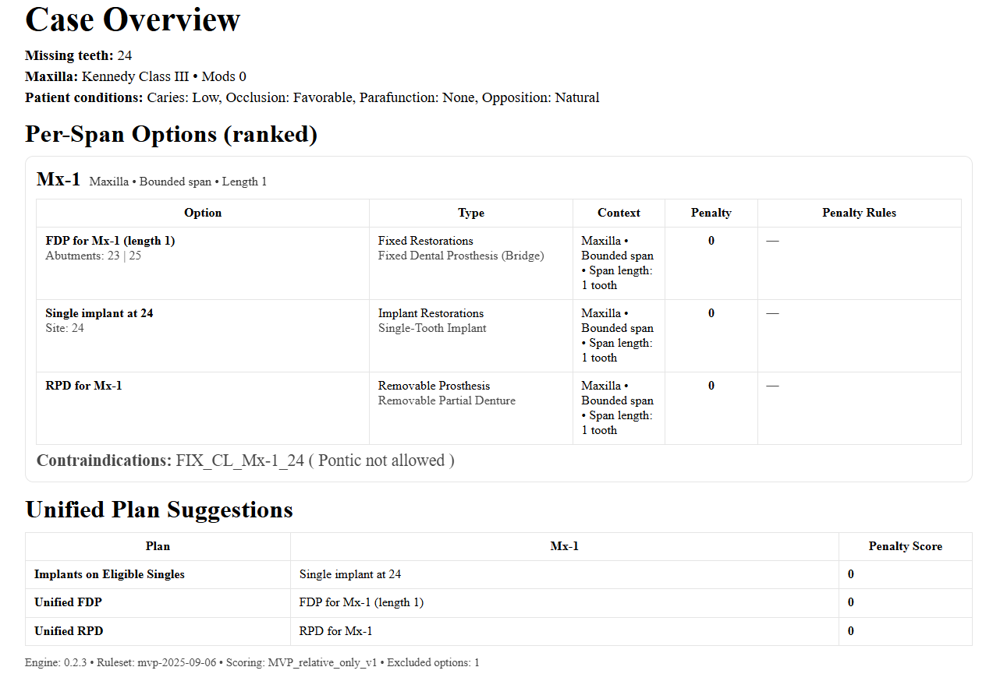

# **CDSS-Prosthesis**

Decision support system for dental prosthesis planning; backend (Python) + frontend (React/Vite).
This is a work-in-progress tool and not medical-ready.
---

## **Showcase**
* **PDF final report example**
  
  


* **Short video showcasing the user journey from start to end**

https://github.com/user-attachments/assets/2dc48d92-bddc-4d6b-b7c7-e46953e55143


---

## **Requirements**

* Python 3.10+ (3.11 recommended)

* Node.js 18+ (20 recommended), npm 9+

---

## **Quick start**

### 1. Backend (API)

#### macOS / Linux

```bash
  cd backend
  python -m venv venv 
  source venv/bin/activate 
  pip install -r requirements.txt 
  uvicorn main:app --reload --port 8000
```

#### Windows 

``` powerShell
  cd backend
  python -m venv venv
  .\venv\Scripts\Activate.ps1
  pip install -r requirements.txt
  uvicorn main:app --reload --port 8000 
  ```


Backend runs at http://localhost:8000

Health check: GET /health → { "ok": true }


### 2. Frontend (UI)

#### macOS / Linux

```  bash
  cd frontend
  cp .env.example .env      # first time only
  npm install
  npm run dev 
  ```


#### Windows (PowerShell)

```  powershell
  cd frontend
  Copy-Item .env.example .env   # first time only
  npm install
  npm run dev 
  ```


*Frontend runs at the URL Vite prints (usually http://localhost:5173).*
