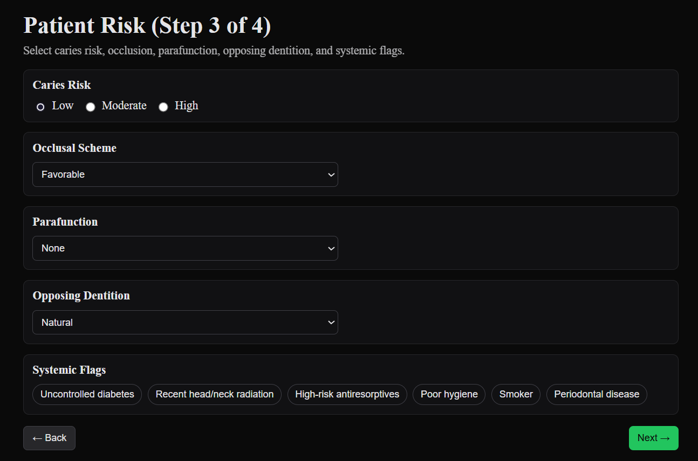

# Showcase

## Step 1. Mark missing teeth
Click teeth to mark them as missing. Here, tooth 24 is selected as missing.

---

## Step 2. Review abutment health
For each abutment, review crown–root ratio, mobility, and enamel suitability.

---

## Step 3. Set patient risk factors
Patient-level conditions such as caries risk, occlusal scheme, parafunction, and systemic risks are selected here.

---

## Step 4. Review generated plans
The system ranks prosthesis options for each span. For multi-span cases, the system works out a unified plan.

---

## Step 5. Generate a report
A printable case report summarizes inputs, options, and selected plans.

[← Back to main README](../README.md)
